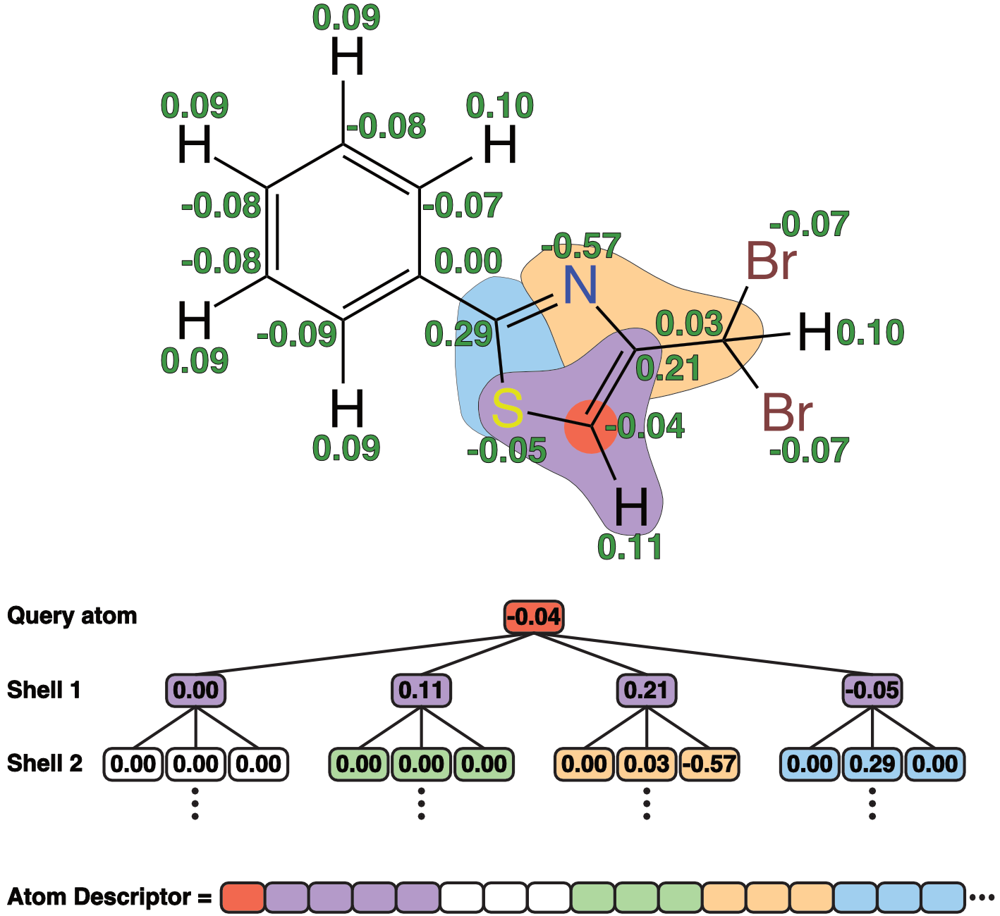

# SMI2GCS
With SMI2GCS you can generate atomic descriptors from SMILES.
The atomic descriptors are based on convolutions of CM5 atomic charges computed using semiempirical tight binding (GFN1-xTB).

  

More information about the method is available in the [RegioML paper](https://doi.org/10.1039/D1DD00032B).
Including: [1](https://doi.org/10.1002/cmdc.201700097), [2](https://doi.org/10.1002/cmdc.201800309), [3](https://doi.org/10.1002/minf.201800115), [4](https://doi.org/10.1186/s13321-019-0381-4), and [5](https://doi.org/10.1021/acs.jcim.8b00758).

# Installation

We recommend using anaconda to install the Python 3 environment:

    conda env create -f environment.yml && conda activate smi2gcs

Then download the binaries of xtb version 6.4.0:

    mkdir dep; cd dep; wget https://github.com/grimme-lab/xtb/releases/download/v6.4.0/xtb-210201.tar.xz; tar -xvf ./xtb-210201.tar.xz; cd ..
